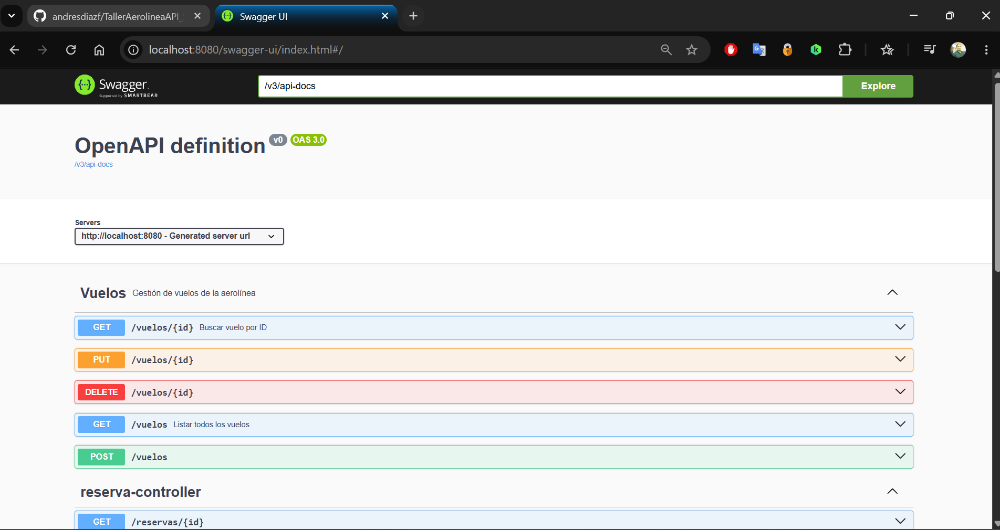
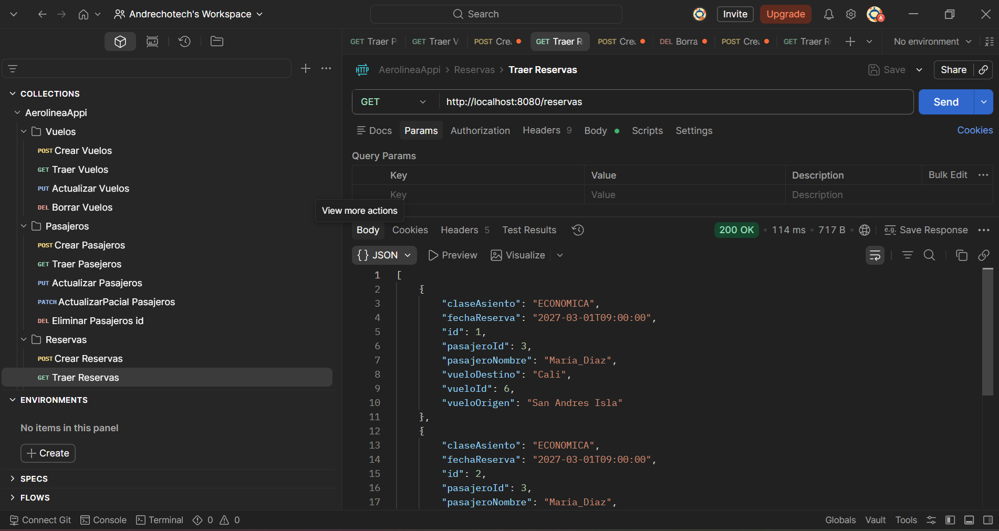
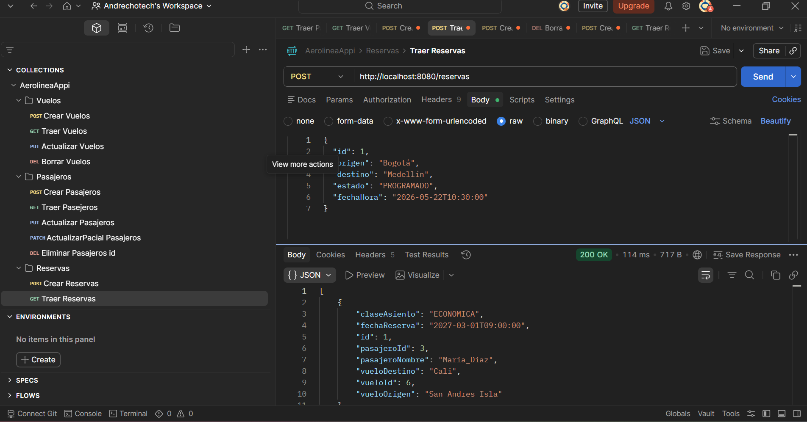
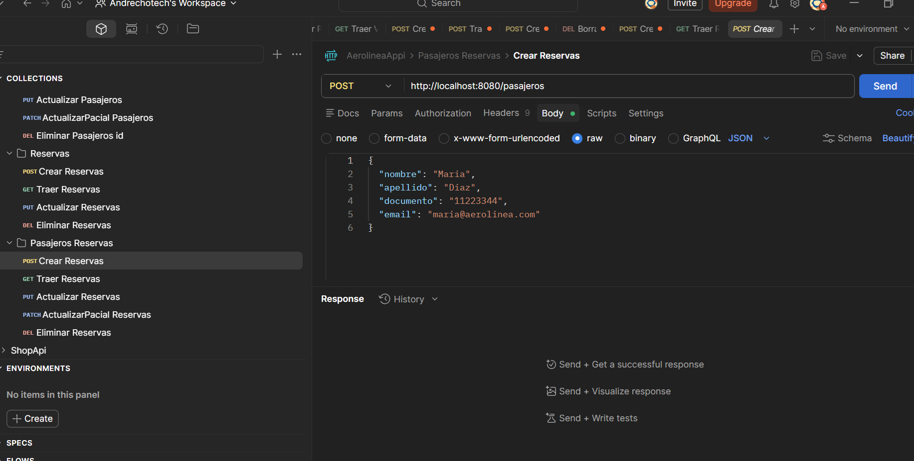

# 🛫 Sistema de Gestión de Aerolínea - API REST

## 📋 Resumen del Proyecto

**AerolineaAppi** es una API REST desarrollada con Spring Boot que permite gestionar las operaciones principales de una aerolínea. El sistema maneja la información de vuelos, pasajeros y reservas, proporcionando endpoints para realizar operaciones CRUD (Crear, Leer, Actualizar, Eliminar) sobre cada una de estas entidades.

La aplicación implementa una arquitectura en capas (Controller-Service-Repository) siguiendo las mejores prácticas de desarrollo con Spring Boot, incluyendo validaciones de datos, manejo de errores y documentación automática con Swagger/OpenAPI.

### 🎯 Características Principales
- Gestión completa de vuelos (origen, destino, fecha/hora, estado)
- Administración de pasajeros con validación de datos
- Sistema de reservas que relaciona pasajeros con vuelos
- Documentación interactiva de la API con Swagger UI
- Validaciones robustas en todas las entidades
- Persistencia de datos con PostgreSQL

---

## 🛠️ Tecnologías Utilizadas

- **Java 17**
- **Spring Boot 4.0.6**
  - Spring Data JPA
  - Spring Web MVC
  - Spring Validation
- **PostgreSQL** - Base de datos relacional
- **Maven** - Gestión de dependencias
- **Swagger/OpenAPI 3.0** - Documentación de API
- **Hibernate** - ORM para persistencia

---

## 📦 Instrucciones de Instalación

### Prerrequisitos

Antes de comenzar, asegúrate de tener instalado:

1. **Java Development Kit (JDK) 17** o superior
   ```bash
   java -version
   ```

2. **PostgreSQL** (versión 12 o superior)
   - Descargar desde: https://www.postgresql.org/download/

3. **Maven** (opcional, el proyecto incluye Maven Wrapper)
   ```bash
   mvn -version
   ```

4. **Git** (para clonar el repositorio)

### Pasos de Instalación

#### 1. Clonar el Repositorio
```bash
git clone <URL_DEL_REPOSITORIO>
cd AerolineaAppi
```

#### 2. Configurar la Base de Datos

Crear la base de datos en PostgreSQL:

```sql
CREATE DATABASE aerolineaapi;
```

#### 3. Configurar las Credenciales

Editar el archivo `src/main/resources/application.properties` con tus credenciales de PostgreSQL:

```properties
spring.datasource.url=jdbc:postgresql://localhost:5432/aerolineaapi
spring.datasource.username=postgres
spring.datasource.password=TU_CONTRASEÑA_AQUI
```

#### 4. Instalar Dependencias

Usando Maven Wrapper (recomendado):
```bash
# Windows
mvnw.cmd clean install

# Linux/Mac
./mvnw clean install
```

O con Maven instalado globalmente:
```bash
mvn clean install
```

---

## 🚀 Guía de Uso

### Iniciar la Aplicación

#### Opción 1: Usando Maven Wrapper
```bash
# Windows
mvnw.cmd spring-boot:run

# Linux/Mac
./mvnw spring-boot:run
```

#### Opción 2: Usando Maven
```bash
mvn spring-boot:run
```

#### Opción 3: Ejecutar el JAR
```bash
mvn clean package
java -jar target/AerolineaAppi-0.0.1-SNAPSHOT.jar
```

### Acceder a la Aplicación

Una vez iniciada la aplicación, estará disponible en:

- **API Base URL**: `http://localhost:8080`
- **Swagger UI**: `http://localhost:8080/swagger-ui/index.html`
- **OpenAPI Docs**: `http://localhost:8080/v3/api-docs`

### Probar los Endpoints

Puedes probar la API usando:

1. **Swagger UI** (Interfaz web interactiva)
   - Navega a `http://localhost:8080/swagger-ui/index.html`
   - Explora y prueba todos los endpoints directamente desde el navegador

2. **Postman** o **Insomnia**
   - Importa la colección desde la documentación OpenAPI
   - URL: `http://localhost:8080/v3/api-docs`

3. **cURL** (Línea de comandos)
   ```bash
   curl -X GET http://localhost:8080/vuelos
   ```

---

## 📸 Ejemplos de Resultados

### Swagger UI - Documentación Interactiva


*Interfaz de Swagger mostrando todos los endpoints disponibles*

### Postman - Obtener Todos los Pasajeros


*Ejemplo de respuesta al obtener la lista de pasajeros*

**Request:**
```http
GET http://localhost:8080/pasajeros
```

**Response (200 OK):**
```json
[
  {
    "id": 1,
    "nombre": "Juan",
    "apellido": "Pérez",
    "documento": "12345678",
    "email": "juan.perez@email.com"
  },
  {
    "id": 2,
    "nombre": "María",
    "apellido": "García",
    "documento": "87654321",
    "email": "maria.garcia@email.com"
  }
]
```

### Postman - Crear una Reserva


*Ejemplo de creación de una nueva reserva*

**Request:**
```http
POST http://localhost:8080/reservas
Content-Type: application/json

{
  "claseAsiento": "ECONOMICA",
  "fechaReserva": "2027-03-01T09:00:00",
  "pasajeroId": 3,
  "vueloId": 6
}
```

**Response (201 CREATED):**
```json
{
  "id": 1,
  "claseAsiento": "ECONOMICA",
  "fechaReserva": "2027-03-01T09:00:00",
  "pasajeroId": 3,
  "pasajeroNombre": "María Díaz",
  "vueloId": 6,
  "vueloOrigen": "San Andrés Isla",
  "vueloDestino": "Cali"
}
```

### Swagger - Obtener Reservas


*Vista de Swagger mostrando el endpoint de reservas con respuesta exitosa*

---

## ✨ Funcionalidades

### 🛫 Gestión de Vuelos

- ✅ **Listar todos los vuelos** - `GET /vuelos`
- ✅ **Buscar vuelo por ID** - `GET /vuelos/{id}`
- ✅ **Crear nuevo vuelo** - `POST /vuelos`
- ✅ **Actualizar vuelo** - `PUT /vuelos/{id}`
- ✅ **Eliminar vuelo** - `DELETE /vuelos/{id}`

**Atributos del Vuelo:**
- Origen (obligatorio)
- Destino (obligatorio)
- Fecha y hora (obligatorio)
- Estado: `A_TIEMPO`, `RETRASADO`, `CANCELADO` (obligatorio)

### 👤 Gestión de Pasajeros

- ✅ **Listar todos los pasajeros** - `GET /pasajeros`
- ✅ **Buscar pasajero por ID** - `GET /pasajeros/{id}`
- ✅ **Crear nuevo pasajero** - `POST /pasajeros`
- ✅ **Actualizar pasajero** - `PUT /pasajeros/{id}`
- ✅ **Eliminar pasajero** - `DELETE /pasajeros/{id}`

**Atributos del Pasajero:**
- Nombre (obligatorio)
- Apellido (obligatorio)
- Documento (obligatorio)
- Email (obligatorio, formato válido)

### 🎫 Gestión de Reservas

- ✅ **Listar todas las reservas** - `GET /reservas`
- ✅ **Buscar reserva por ID** - `GET /reservas/{id}`
- ✅ **Crear nueva reserva** - `POST /reservas`
- ✅ **Actualizar reserva** - `PUT /reservas/{id}`
- ✅ **Eliminar reserva** - `DELETE /reservas/{id}`

**Atributos de la Reserva:**
- Fecha de reserva (obligatorio)
- Clase de asiento: `ECONOMICA`, `EJECUTIVA`, `PRIMERA_CLASE` (obligatorio)
- ID del pasajero (obligatorio)
- ID del vuelo (obligatorio)

**Características especiales:**
- Las reservas utilizan DTOs para evitar ciclos de serialización
- Respuestas enriquecidas con información del pasajero y vuelo
- Validación de existencia de pasajero y vuelo al crear/actualizar

---

## ⚠️ Manejo de Errores

La aplicación implementa un manejo robusto de errores con respuestas HTTP apropiadas:

### Códigos de Estado HTTP

| Código | Descripción | Cuándo se usa |
|--------|-------------|---------------|
| **200 OK** | Operación exitosa | GET, PUT exitosos |
| **201 CREATED** | Recurso creado | POST exitoso |
| **204 NO CONTENT** | Eliminación exitosa | DELETE exitoso |
| **400 BAD REQUEST** | Datos inválidos | Validaciones fallidas |
| **404 NOT FOUND** | Recurso no encontrado | ID inexistente |
| **500 INTERNAL SERVER ERROR** | Error del servidor | Errores inesperados |

### Ejemplos de Validación

#### Error de Validación - Campo Vacío
```json
{
  "timestamp": "2026-05-24T10:30:00",
  "status": 400,
  "error": "Bad Request",
  "message": "El nombre no puede estar vacío",
  "path": "/pasajeros"
}
```

#### Error de Validación - Email Inválido
```json
{
  "timestamp": "2026-05-24T10:30:00",
  "status": 400,
  "error": "Bad Request",
  "message": "El email no tiene un formato válido",
  "path": "/pasajeros"
}
```

#### Error - Recurso No Encontrado
```json
{
  "timestamp": "2026-05-24T10:30:00",
  "status": 404,
  "error": "Not Found",
  "message": "Vuelo no encontrado con ID: 999",
  "path": "/vuelos/999"
}
```

### Validaciones Implementadas

#### Pasajeros
- ✅ Nombre no puede estar vacío
- ✅ Apellido no puede estar vacío
- ✅ Documento es obligatorio
- ✅ Email es obligatorio y debe tener formato válido

#### Vuelos
- ✅ Origen no puede estar vacío
- ✅ Destino no puede estar vacío
- ✅ Fecha y hora son obligatorias
- ✅ Estado del vuelo es obligatorio

#### Reservas
- ✅ Fecha de reserva es obligatoria
- ✅ Clase de asiento es obligatoria
- ✅ ID del pasajero debe existir en la base de datos
- ✅ ID del vuelo debe existir en la base de datos

---

## 📡 Información de la API

### Base URL
```
http://localhost:8080
```

### Endpoints Principales

#### Vuelos

| Método | Endpoint | Descripción |
|--------|----------|-------------|
| GET | `/vuelos` | Obtener todos los vuelos |
| GET | `/vuelos/{id}` | Obtener un vuelo por ID |
| POST | `/vuelos` | Crear un nuevo vuelo |
| PUT | `/vuelos/{id}` | Actualizar un vuelo |
| DELETE | `/vuelos/{id}` | Eliminar un vuelo |

**Ejemplo de Payload (POST/PUT):**
```json
{
  "origen": "Bogotá",
  "destino": "Medellín",
  "fechaHora": "2027-06-15T14:30:00",
  "estado": "A_TIEMPO"
}
```

#### Pasajeros

| Método | Endpoint | Descripción |
|--------|----------|-------------|
| GET | `/pasajeros` | Obtener todos los pasajeros |
| GET | `/pasajeros/{id}` | Obtener un pasajero por ID |
| POST | `/pasajeros` | Crear un nuevo pasajero |
| PUT | `/pasajeros/{id}` | Actualizar un pasajero |
| DELETE | `/pasajeros/{id}` | Eliminar un pasajero |

**Ejemplo de Payload (POST/PUT):**
```json
{
  "nombre": "Carlos",
  "apellido": "Rodríguez",
  "documento": "1234567890",
  "email": "carlos.rodriguez@email.com"
}
```

#### Reservas

| Método | Endpoint | Descripción |
|--------|----------|-------------|
| GET | `/reservas` | Obtener todas las reservas |
| GET | `/reservas/{id}` | Obtener una reserva por ID |
| POST | `/reservas` | Crear una nueva reserva |
| PUT | `/reservas/{id}` | Actualizar una reserva |
| DELETE | `/reservas/{id}` | Eliminar una reserva |

**Ejemplo de Payload (POST/PUT):**
```json
{
  "fechaReserva": "2027-05-20T10:00:00",
  "claseAsiento": "EJECUTIVA",
  "pasajeroId": 1,
  "vueloId": 2
}
```

### Enumeraciones

#### EstadoVuelo
```java
A_TIEMPO
RETRASADO
CANCELADO
```

#### ClaseAsiento
```java
ECONOMICA
EJECUTIVA
PRIMERA_CLASE
```

### Headers Recomendados

```http
Content-Type: application/json
Accept: application/json
```

---

## 🔮 Mejoras Futuras

### Funcionalidades Planeadas

- [ ] **Autenticación y Autorización**
  - Implementar Spring Security
  - JWT para autenticación de usuarios
  - Roles: Admin, Empleado, Cliente

- [ ] **Búsquedas Avanzadas**
  - Buscar vuelos por origen y destino
  - Filtrar vuelos por fecha y estado
  - Buscar pasajeros por documento o email
  - Historial de reservas por pasajero

- [ ] **Gestión de Asientos**
  - Modelo de Asiento con número y disponibilidad
  - Selección de asiento específico al reservar
  - Mapa de asientos disponibles por vuelo

- [ ] **Sistema de Notificaciones**
  - Envío de emails de confirmación de reserva
  - Notificaciones de cambios en el estado del vuelo
  - Recordatorios de vuelo próximo

- [ ] **Reportes y Estadísticas**
  - Dashboard con métricas de vuelos
  - Reportes de ocupación por vuelo
  - Estadísticas de pasajeros frecuentes

- [ ] **Paginación y Ordenamiento**
  - Implementar paginación en listados
  - Opciones de ordenamiento por diferentes campos
  - Filtros combinados

- [ ] **Gestión de Aerolíneas**
  - Modelo de Aerolínea
  - Múltiples aerolíneas en el sistema
  - Asociar vuelos a aerolíneas específicas

- [ ] **Sistema de Precios**
  - Modelo de Tarifa por clase de asiento
  - Cálculo de precio total de reserva
  - Descuentos y promociones

- [ ] **Integración con Servicios Externos**
  - API de clima para información de vuelos
  - Integración con sistemas de pago
  - Servicios de geolocalización

- [ ] **Mejoras Técnicas**
  - Implementar caché con Redis
  - Agregar tests unitarios y de integración
  - Dockerizar la aplicación
  - CI/CD con GitHub Actions
  - Documentación con Postman Collection

---

## 📁 Estructura del Proyecto

```
AerolineaAppi/
├── src/
│   ├── main/
│   │   ├── java/com/genjava11/AerolineaAppi/
│   │   │   ├── controller/          # Controladores REST
│   │   │   │   ├── PasajeroController.java
│   │   │   │   ├── ReservaController.java
│   │   │   │   └── VueloController.java
│   │   │   ├── DTO/                 # Data Transfer Objects
│   │   │   │   ├── ReservaRequestDTO.java
│   │   │   │   └── ReservaResponseDTO.java
│   │   │   ├── model/               # Entidades JPA
│   │   │   │   ├── ClaseAsiento.java
│   │   │   │   ├── EstadoVuelo.java
│   │   │   │   ├── Pasajero.java
│   │   │   │   ├── Reserva.java
│   │   │   │   └── Vuelo.java
│   │   │   ├── repository/          # Repositorios JPA
│   │   │   │   ├── PasajeroRepository.java
│   │   │   │   ├── ReservaRepository.java
│   │   │   │   └── VueloRepository.java
│   │   │   ├── service/             # Lógica de negocio
│   │   │   │   ├── PasajeroService.java
│   │   │   │   ├── ReservaService.java
│   │   │   │   └── VueloService.java
│   │   │   └── AerolineaAppiApplication.java
│   │   └── resources/
│   │       ├── application.properties
│   │       ├── static/
│   │       └── templates/
│   └── test/                        # Tests
├── docs/                            # Documentación adicional
│   └── images/                      # Capturas de pantalla
├── .gitignore
├── pom.xml                          # Configuración Maven
└── README.md
```

---

## 👨‍💻 Autor

**Desarrollado por Andrés Diaz con apoyo de Generation Colombia - Bootcamp Java 11**

---

## 📄 Licencia

Este proyecto fue desarrollado como parte del programa de formación de Generation Colombia.

---

## 🤝 Contribuciones

Las contribuciones son bienvenidas. Por favor:

1. Fork el proyecto
2. Crea una rama para tu feature (`git checkout -b feature/AmazingFeature`)
3. Commit tus cambios (`git commit -m 'Add some AmazingFeature'`)
4. Push a la rama (`git push origin feature/AmazingFeature`)
5. Abre un Pull Request

---

## 📞 Soporte

Si tienes preguntas o problemas:

1. Revisa la documentación de Swagger UI
2. Verifica la configuración de la base de datos
3. Consulta los logs de la aplicación

---

## 🙏 Agradecimientos

- Generation Colombia por la formación
- Spring Boot por el excelente framework
- La comunidad de desarrolladores Java

---

**¡Gracias por usar AerolineaAppi! ✈️**
